Mylo Slow Feeder
================
Dan Minkler
4/28/2022

# Project Overview

In this project, I evaluated how long it took my dog, Mylo, to eat out
of two different bowls (feeders). We orginally fed him out of your
typical flat bottomed metal bowl, but we had recently switched over to
using a slow feeder. I could tell that it took him longer to eat out of
it, but I wondered how long exactly, and is it a consistent and
reproducible amount?

In my findings which I walk through in this project, I discovered,
initially, that the slow feeder resulted in Mylo eating almost 4.5
minutes slower than with the traditional bowl! That is a total feeding
time of a little over 7 minutes! That is great news for him since I
believe it’s better on a dog’s stomach to not scarf food down so
quickly. It also helps keep him entertained while I am getting ready for
work/school in the morning. Things got a little interesting when I had
my wife run the experiment on one of the days which generated a
perplexing outlier data point. In my search to understand the outlier, I
found that Mylo is getting faster at eating out of the slow feeder over
time. Over a about a two and a half month time frame, Mylo seems to have
shaved 1.3 minutes of his eating time in the slow feeder.

All this data, and the stats behind it, are explored in the notebook
below!

/Documents/Mylo/Mylo%20Slow%20Feeder%20Project/Photos/pup_waiting.jpeg)

## The two feeders

/Documents/Mylo/Mylo%20Slow%20Feeder%20Project/Photos/both_feeders.jpeg)

## Methods

I tried to keep this experiment as controlled as possible. I fed him at
the same times every day. Food was evenly distributed in the feeders
unless otherwise specified. Exactly 137 grams of Blue brand chicken and
brown rice recipe dog food was used for all experiments. Timing started
when he started eating and stopped as soon as he finsihed and moved his
head away from the bowl

## Animal Rights Disclaimer

No animals were harmed during this experiment in any way, shape, or
form. That said, some animals may have been slightly annoyed by having
to wait for someone to meticulously weigh out their food.

# Load Libraries and Populate Data

## Libraries

``` r
library(dplyr)
```

    ## 
    ## Attaching package: 'dplyr'

    ## The following objects are masked from 'package:stats':
    ## 
    ##     filter, lag

    ## The following objects are masked from 'package:base':
    ## 
    ##     intersect, setdiff, setequal, union

``` r
library(tidyverse)
```

    ## ── Attaching packages ─────────────────────────────────────── tidyverse 1.3.1 ──

    ## ✓ ggplot2 3.3.5     ✓ purrr   0.3.4
    ## ✓ tibble  3.1.6     ✓ stringr 1.4.0
    ## ✓ tidyr   1.1.4     ✓ forcats 0.5.1
    ## ✓ readr   2.1.2

    ## ── Conflicts ────────────────────────────────────────── tidyverse_conflicts() ──
    ## x dplyr::filter() masks stats::filter()
    ## x dplyr::lag()    masks stats::lag()

``` r
library(ggplot2)
library(broom)
library(stats)
library(car)
```

    ## Loading required package: carData

    ## 
    ## Attaching package: 'car'

    ## The following object is masked from 'package:purrr':
    ## 
    ##     some

    ## The following object is masked from 'package:dplyr':
    ## 
    ##     recode

``` r
library(RColorBrewer)
```

## Data Upload from Excel File

``` r
mylo_data = readxl::read_excel('/Users/DanMinkler/Dropbox/My Mac (new-host-4.home)/Documents/mylo_slow_feeder_data.xlsx')

#Fix data point 
mylo_data[mylo_data$Feeder == "Madison", which(colnames(mylo_data) == 'Feeder Type')] = 'slow'
```

## Correct some column names for ease of use

``` r
colnames(mylo_data)[4:5] = c('time_to_eat_min', 'feeder_type')
```

# Explore data using visualizations

## Effect of feeder type on the time it takes for Mylo to eat.

``` r
ggplot(data = mylo_data, mapping = aes(x = feeder_type, y = time_to_eat_min, fill = feeder_type)) +
  geom_boxplot(alpha = 0.6, notch = FALSE, notchwidth = 0.99) + 
  geom_label(
    label = 'The one time \n my wife ran \n the experiment',
    x = 1.5,
    y = 5,
    position = position_nudge(x = 0.55, y = 5),
    label.padding = unit(0.2, "lines"),
    label.size = 0.1 ,
    color = 'black',
    fill = "white"
  ) +
   annotate("segment", x = 1.7 , xend = 1.95, y = 4.95, yend = 4.95, alpha = 0.5, arrow = arrow(length = unit(3, "mm"))) +
  stat_summary(fun.y = mean, geom = "point", shape = 23, size = 5, alpha = 0.3, color = "white", fill = "black") +
  theme(legend.position = "none") +
  scale_fill_brewer(palette = "Set1")+
  theme_bw() +
  scale_y_continuous(breaks = seq(0,10,1), limits = c(0,8)) +
  labs(y = "Mylo's Eating Time (in minutes)", x = "Feeder Type") +
  coord_flip()
```

    ## Warning: `fun.y` is deprecated. Use `fun` instead.

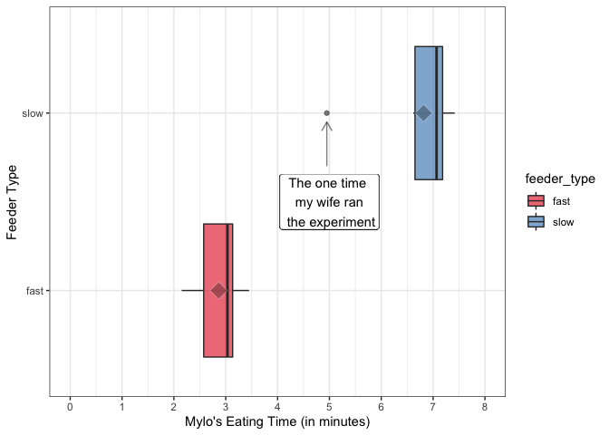<!-- -->

Based on this visualization, I believe a couple things are clear: -
There appears to be a sizable difference between the two feeders w/
regards to the time it takes Mylo to eat - There seems to be more
variability in the eating times for the fast feeder as compared for the
slow feeder - Something definitely happened when my wife ran this
experiment for me one day. I have a hunch though…

First, let’s do a statistical test on this difference, then keep
exploring some other possible trends via visualizations. But before any
of that, I will remove the outlier point. We can revisit this later.

``` r
#Remove the outlier
mylo_data_sans_outliers = mylo_data[-which(mylo_data$time_to_eat_min == 4.95),]
```

## ANOVA for feeder type

``` r
### Run ANOVA ###

feeder_type_aov = aov(time_to_eat_min ~ feeder_type, data = mylo_data_sans_outliers)
summary(feeder_type_aov)
```

    ##             Df Sum Sq Mean Sq F value   Pr(>F)    
    ## feeder_type  1  65.41   65.41   457.5 1.62e-11 ***
    ## Residuals   13   1.86    0.14                     
    ## ---
    ## Signif. codes:  0 '***' 0.001 '**' 0.01 '*' 0.05 '.' 0.1 ' ' 1

The ANOVA enthusiastically backs the visual finding that there is a
significant difference in Mylo’s eating time between the two feeder
types.

To verify the ANOVA results, assumptions were checked as follows.

``` r
### Check assumptions for ANOVA ###

# Assumption 1: Obs. are independent. This is true here

# Assumption 2: Errors are normally distributed - Visual test

 plot(feeder_type_aov, which = c(1,2))
```

<!-- --><!-- -->

``` r
  #looking at the Q-Q plot of residuals, it appears that the errors are normally distributed. 
  
# Assumption 2: Errors are normally distributed - Formal statistical test 

shapiro.test(residuals(feeder_type_aov))
```

    ## 
    ##  Shapiro-Wilk normality test
    ## 
    ## data:  residuals(feeder_type_aov)
    ## W = 0.95652, p-value = 0.6323

``` r
  #For the formal test (Shapiro-Wilk),  we have a p-value of 0.6323, so there is insufficient evidence to overturn the hypothesis that the data is normal.
  #Thanks for the great data Mylo!

# Assumption 3: Equal Variance - Visual test 
  #From both the residuals vs. fitted, and the original box plot for this data, it does look like there is more variability when Mylo is eating out of the "fast" feeder as opposed to the slow feeder. I'll defer to a formal test here. 

# Assumption 3: Equal Variance - Formal statistical test

leveneTest(time_to_eat_min ~ feeder_type, data = mylo_data_sans_outliers, center = 'mean')
```

    ## Warning in leveneTest.default(y = y, group = group, ...): group coerced to
    ## factor.

    ## Levene's Test for Homogeneity of Variance (center = "mean")
    ##       Df F value Pr(>F)
    ## group  1  1.8149 0.2009
    ##       13

``` r
  #For the leveneTest, we have a p-value of 0.4216, so there isn't enough here to say that the variances are not equal
```

The assumptions for ANOVA were satisfied, so we can take the results as
accurate.

From the ANOVA, we can see what the statiscally significant average
difference between the two groups is:

``` r
# How much slower the feeder is
print(paste('When we feed Mylo using the slow feeder, he eats, on average,', round(feeder_type_aov$coefficients[2],2), 'minutes slower'))
```

    ## [1] "When we feed Mylo using the slow feeder, he eats, on average, 4.19 minutes slower"

``` r
#How much slower the feeder is with a 95% confidence interval 

print(paste('With 95% confidence, we can say the true mean lies between', round(confint(feeder_type_aov)[2,1],2), 'and', round(confint(feeder_type_aov)[2,2],2), 'minutes, in terms of how much longer it takes Mylo to eat using the slow feeder'))
```

    ## [1] "With 95% confidence, we can say the true mean lies between 3.76 and 4.61 minutes, in terms of how much longer it takes Mylo to eat using the slow feeder"

This is both a statistically and practically significant finding.

By feeding him with the slow feeder, I am getting over four more minutes
on average where I can make my breakfast or dinner and Mylo is happy and
occupied. AND, I am sure Mylo’s tummy appreciates him not scarfing down
food like he’s never been fed before.

## Differences between feeding him in the morning and at night, with respect to Mylo’s eating time, across the two feeders

``` r
#Calculate the standard deviation for the groups to facilitate error bars

mylo_data_sans_outliers =  mylo_data_sans_outliers %>% group_by(feeder_type, Time) %>% 
  summarize(sd_time_of_day_feeder_type = sd(time_to_eat_min), 
            mean_time_of_day_feeder_type = mean(time_to_eat_min)) %>% 
            right_join(mylo_data_sans_outliers, by = c('feeder_type', 'Time'))
```

    ## `summarise()` has grouped output by 'feeder_type'. You can override using the `.groups` argument.

``` r
#Plot side by side bar graph with error bars (1 std dev)

ggplot(data = mylo_data_sans_outliers, mapping = aes(x = feeder_type, y = time_to_eat_min, fill = Time)) +
  geom_bar(stat = 'summary', fun = "mean", position = 'dodge', alpha = 0.75) + 
  geom_errorbar(aes(y = mean_time_of_day_feeder_type, ymin = mean_time_of_day_feeder_type - sd_time_of_day_feeder_type, 
                    ymax = mean_time_of_day_feeder_type + sd_time_of_day_feeder_type), color = 'black', position = position_dodge(0.9)) +
  theme(legend.position = "none") +
  scale_fill_brewer(palette = "Set1")+
  theme_bw() +
  scale_y_continuous(breaks = seq(0,10,1), limits = c(0,8)) +
  labs(y = "Mylo's Average Eating Time (in minutes)", x = "Feeder Type") + 
  coord_flip() 
```

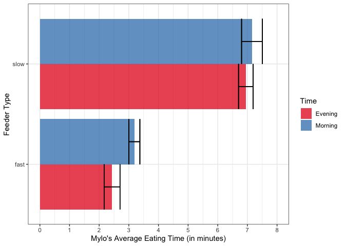<!-- -->

From here, it looks as though there may be a difference in Mylo’s eating
times when comparing feeding in morning versus at night. This seems more
likely for the ‘fast’ feeder type when looking at the error bars
(constructed from 1 std.devs).

A formal test will be needed to see if there is actually a difference
here, it’s difficult to say visually.

Use of sliced ANOVA to determine differences inside the groups

``` r
sliced_anova_models = mylo_data_sans_outliers %>% 
  group_by(feeder_type) %>% 
  group_modify(~ broom::tidy(aov(time_to_eat_min ~ Time, data = .))) %>% filter(term == 'Time')

sliced_anova_models
```

    ## # A tibble: 2 × 7
    ## # Groups:   feeder_type [2]
    ##   feeder_type term     df  sumsq meansq statistic p.value
    ##   <chr>       <chr> <dbl>  <dbl>  <dbl>     <dbl>   <dbl>
    ## 1 fast        Time      1 0.975  0.975     19.7   0.00677
    ## 2 slow        Time      1 0.0868 0.0868     0.948 0.368

``` r
sliced_lm_models = mylo_data_sans_outliers %>% 
  group_by(feeder_type) %>% 
  group_modify(~broom::tidy(lm(time_to_eat_min ~ Time, data = .))) %>% filter(term == 'TimeMorning')

sliced_lm_models
```

    ## # A tibble: 2 × 6
    ## # Groups:   feeder_type [2]
    ##   feeder_type term        estimate std.error statistic p.value
    ##   <chr>       <chr>          <dbl>     <dbl>     <dbl>   <dbl>
    ## 1 fast        TimeMorning    0.754     0.170     4.44  0.00677
    ## 2 slow        TimeMorning    0.208     0.214     0.974 0.368

From both the sliced anova and linear regressions, we can see that the
time of feeding is indeed significant for the fast (standard) feeder. It
takes longer for him to eat in the morning as opposed to at night.
Specifically, 0.754 minutes (45 seconds) longer on average.

Of course, let’s verify assumptions!

``` r
sliced_anova_models_nest = mylo_data_sans_outliers %>%
  group_by(feeder_type) %>% 
  nest() %>%
  mutate(aov = map(data, ~aov(time_to_eat_min ~ Time, data = .x)))

### Assumptions 
# Assumption 1: Obs. are independent. This is true here for both!

# Assumption 2: Errors are normally distributed - Visual test

 plot(sliced_anova_models_nest$aov[[1]], which = c(1,2)) # Fast feeder
```

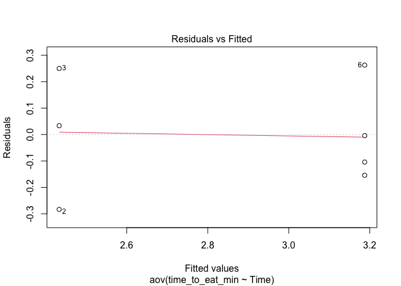<!-- -->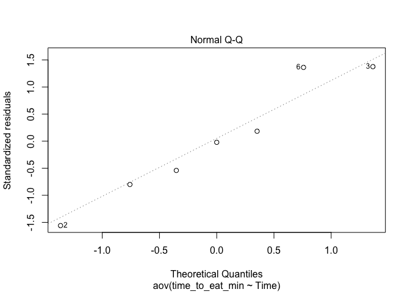<!-- -->

``` r
 plot(sliced_anova_models_nest$aov[[2]], which = c(1,2)) # Slow feeder 
```

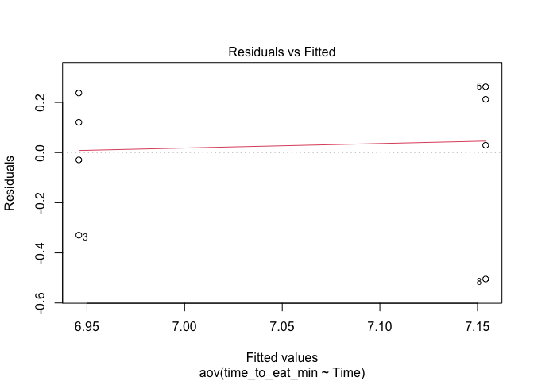<!-- --><!-- -->

``` r
  #looking at the Q-Q plot of residuals, it appears that the errors are normally distributed for the Fast feeder. There does appear to be some deviation at the tails for the slow feeder. We will defer to the shapiro-wilk test for a formal assessment. 
  
# Assumption 2: Errors are normally distributed - Formal statistical test 

  shapiro.test(residuals(sliced_anova_models_nest$aov[[1]])) # Fast feeder
```

    ## 
    ##  Shapiro-Wilk normality test
    ## 
    ## data:  residuals(sliced_anova_models_nest$aov[[1]])
    ## W = 0.9389, p-value = 0.6288

``` r
  shapiro.test(residuals(sliced_anova_models_nest$aov[[2]])) # Slow feeder
```

    ## 
    ##  Shapiro-Wilk normality test
    ## 
    ## data:  residuals(sliced_anova_models_nest$aov[[2]])
    ## W = 0.86827, p-value = 0.145

``` r
  #For the formal test (Shapiro-Wilk), both feeders pass the Shapiro-wilk test. We will consider this good enough!

# Assumption 3: Equal Variance - Visual test 
  # From both the residuals vs. fitted, and the original box plot for this data, it does look like there is more variability when Mylo is eating out of the "fast" feeder as opposed to the slow feeder. I'll defer to a formal test here. 

# Assumption 3: Equal Variance - Formal statistical test

leveneTest(time_to_eat_min ~ Time, data = mylo_data_sans_outliers %>% filter(feeder_type == 'fast'), center = 'mean')
```

    ## Warning in leveneTest.default(y = y, group = group, ...): group coerced to
    ## factor.

    ## Levene's Test for Homogeneity of Variance (center = "mean")
    ##       Df F value Pr(>F)
    ## group  1  0.3983 0.5557
    ##        5

``` r
leveneTest(time_to_eat_min ~ Time, data = mylo_data_sans_outliers %>% filter(feeder_type == 'slow'), center = 'mean')
```

    ## Warning in leveneTest.default(y = y, group = group, ...): group coerced to
    ## factor.

    ## Levene's Test for Homogeneity of Variance (center = "mean")
    ##       Df F value Pr(>F)
    ## group  1  0.3827 0.5589
    ##        6

``` r
  #The Morning and Evening times (errors) for both the fast and the slow feeder exhibit homoscedasticity 
```

### By taking these anova and linear regression results (and having verified assumptions) we can say:

``` r
feed_time_slow_feeder_aov = aov(time_to_eat_min ~ Time, data = mylo_data_sans_outliers %>% filter(feeder_type == 'slow'))
feed_time_fast_feeder_aov = aov(time_to_eat_min ~ Time, data = mylo_data_sans_outliers %>% filter(feeder_type == 'fast'))

# How much slower the fast feeder is in the morning
print(paste('When we feed Mylo using the fast feeder, he eats, on average,', round(feed_time_fast_feeder_aov$coefficients[2],2), 'minutes slower or', round(feed_time_fast_feeder_aov$coefficients[2],2)*60, 'seconds slower in the Morning as opposed to at Night'))
```

    ## [1] "When we feed Mylo using the fast feeder, he eats, on average, 0.75 minutes slower or 45 seconds slower in the Morning as opposed to at Night"

``` r
# How much slower the fast feeder is in the morning with a 95% confidence interval 

print(paste('With 95% confidence, we can say the true mean lies between', round(confint(feed_time_fast_feeder_aov)[2,1],2)*60, 'and', round(confint(feed_time_fast_feeder_aov)[2,2],2)*60, 'seconds, in terms of how much longer it takes Mylo to eat using the fast feeder in the Morning as opposed to at Night'))
```

    ## [1] "With 95% confidence, we can say the true mean lies between 19.2 and 71.4 seconds, in terms of how much longer it takes Mylo to eat using the fast feeder in the Morning as opposed to at Night"

While these findings are statistically significant at an alpha level of
0.05, it’s worth asking whether these findings are practically
significant. If the true mean is closer to the upper end of the
confidence interval, 71.4 seconds (over a minute!), I would say that is
practically significant. Given that his mean eating time in the Evening
for the fast feeder was around 2.5 minutes, that is close to saying it
takes him 50% longer to eat in the Morning.

However, if the true mean is closer to 19.2 seconds, that is only about
13% longer and practically speaking, 19.2 seconds just isn’t a very long
time.

One thing is clear and interesting though, and that is that the slow
feeder obfuscates whatever difference there is between the feeding
times.

Let’s also see if there are any differences across treatment days, as in
do his eating times vary based on the day, and are their any trends
across time?

## Eating times over the treatment days

``` r
#Plot two: Time to eat across days stratified by feeder_type ONLY
ggplot(data = mylo_data_sans_outliers, mapping = aes(x = Day, y = time_to_eat_min)) +
  geom_line(aes(group = feeder_type, color = feeder_type)) +
  geom_point(alpha = 0.4) +
  theme(legend.position = "none") +
  scale_fill_brewer(palette = "Set1")+
  theme_bw() +
    scale_y_continuous(breaks = seq(0,10,1), limits = c(0,8))
```

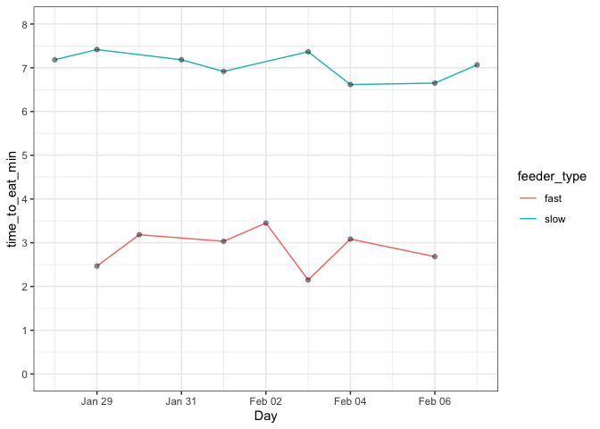<!-- -->

``` r
#Plot two: Time to eat across days stratified by feeder_type AND feeding TIME
ggplot(data = mylo_data_sans_outliers, mapping = aes(x = Day, y = time_to_eat_min)) +
  geom_line(aes(group = interaction(feeder_type, Time), color = feeder_type, linetype = Time)) +
  geom_point(alpha = 0.4) +
  theme(legend.position = "none") +
  scale_fill_brewer(palette = "Set1")+
  theme_bw() +
    scale_y_continuous(breaks = seq(0,10,1), limits = c(0,8))
```

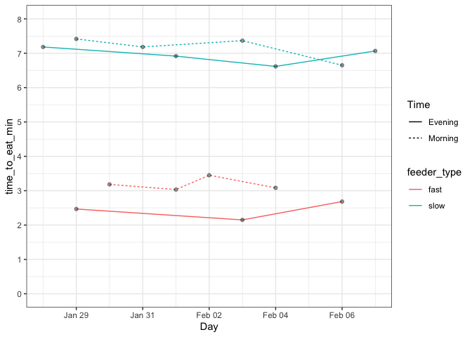<!-- -->

It almost appears as though for the slow feeder, there may be a decrease
over time in the amount of time it takes Mylo to eat. Maybe he’s getting
accustomed to the feeder and can more quickly eat his food. While this
may make sense as a logical hypothesis, my feeling is that a formal
statistical test would not show this effect.

Either way, there’s really not enough data here to truly identify if
there are any trends.

But, for sake of argument, let’s take a quick look at some statistical
regression tests for this:

``` r
lm_models = mylo_data_sans_outliers %>% 
  group_by(feeder_type, Time) %>% 
  group_modify(~ broom::tidy(lm(time_to_eat_min ~ Day, data = .))) %>%
  filter(term == 'Day')

lm_models
```

    ## # A tibble: 4 × 7
    ## # Groups:   feeder_type, Time [4]
    ##   feeder_type Time    term       estimate   std.error statistic p.value
    ##   <chr>       <chr>   <chr>         <dbl>       <dbl>     <dbl>   <dbl>
    ## 1 fast        Evening Day    0.000000207  0.000000740    0.279    0.827
    ## 2 fast        Morning Day   -0.0000000371 0.000000730   -0.0508   0.964
    ## 3 slow        Evening Day   -0.000000256  0.000000433   -0.592    0.614
    ## 4 slow        Morning Day   -0.000000917  0.000000502   -1.83     0.209

Here, looking across feeder type AND feeding time, we see that all
p-values are thoroughly insignificant at the traditional alpha = 0.05
level. It doesn’t look like Mylo’s eating time is trending up or down
across any combination of feeder type or feeding time.

Now, we can also look at JUST feeder type and see if there is any global
trend irregardless of feeding time.

``` r
lm_models_2 = mylo_data_sans_outliers %>% 
  group_by(feeder_type) %>% 
  group_modify(~ broom::tidy(lm(time_to_eat_min ~ Day, data = .))) %>%
  filter(term == 'Day')

lm_models_2
```

    ## # A tibble: 2 × 6
    ## # Groups:   feeder_type [2]
    ##   feeder_type term      estimate   std.error statistic p.value
    ##   <chr>       <chr>        <dbl>       <dbl>     <dbl>   <dbl>
    ## 1 fast        Day   -0.000000132 0.000000834    -0.159   0.880
    ## 2 slow        Day   -0.000000545 0.000000324    -1.68    0.143

The same appears to be true here as well, no trends across time for
Mylo’s eating time with the two feeders.

# Outlier Investigation

Earlier, we removed the outlier from when my wife ran the experimrnt.
Let’s add that outlier back in and see what is going on. As part of this
investigation into the cause of the outlier, new data was collected. The
original experiment took place in late Jan/early Feb of 2022. The new
data was collected in April 2022.

The main hunch was that I thought my wife may not have evenly
distributed the food across the slow feeder, perhaps she had just poured
most of it in the center. So, I collected data first testing this
hypothesis by doing a center pour. Then, to verify my findings, I ran
positive controls to replicate the original slow feeder data where I had
made extra effort to spread the food as much as possible (evenly
distributed) in the feeder.

## Food Distribution Methods for the Slow Feeder

### Evenly Distributed Food in the Feeder

/Documents/Mylo/Mylo%20Slow%20Feeder%20Project/Photos/even_dist.jpeg)

### Center Pour

/Documents/Mylo/Mylo%20Slow%20Feeder%20Project/Photos/center_pour.jpeg)

### Mylo Being Somewhat Fed Up with this Whole Thing

/Documents/Mylo/Mylo%20Slow%20Feeder%20Project/Photos/Cute1.jpeg)

## Data Upload from Excel File and Merge to Existing Data

``` r
#Load in new data 
mylo_outlier_data = readxl::read_excel('/Users/DanMinkler/Dropbox/My Mac (new-host-4.home)/Documents/mylo_slow_feeder_data.xlsx', sheet = 2, range = "A1:G9")

#Rename columns for ease of use
colnames(mylo_outlier_data)[4:5] = c('time_to_eat_min', 'feeder_type')
colnames(mylo_outlier_data)[7] = 'food_distribution'

#Create a food distribution table in original dataset. If the feeder was Dan, distribution was even, if Madison, it was not recorded, so unknown will be used. 
mylo_data$food_distribution = ifelse(mylo_data$Feeder == 'Dan', 'even', 'unknown')

#Create a union of the new and old dataset
full_dataset = union(mylo_data, mylo_outlier_data)

#Fix naming convention for "slow" feeder
full_dataset$feeder_type = gsub('Slow', 'slow', full_dataset$feeder_type)

#Rename the food distributions
full_dataset$food_distribution = gsub('even', 'evenly_distributed', full_dataset$food_distribution)
full_dataset$food_distribution = gsub('mound', 'center_pour', full_dataset$food_distribution)
```

## Explore the new data collected

### First create a column to desginate new and old data by data

``` r
full_dataset = full_dataset %>% mutate(data_designation = ifelse(Day < "2022-04-01", 'Jan-Feb_2022', 'April_2022'))
```

### Visuzlize the data via box plots

First, let’s see if we can determine whether Madison’s outlier data
point was the result of a center pour rather than an evenly distributed
pour. Here, we will only consider the new April data generated from the
center pour.

``` r
ggplot(data = full_dataset %>% filter(feeder_type == 'slow' & data_designation != 'April_2022' | food_distribution != 'evenly_distributed'),
mapping = aes(x = forcats::fct_relevel(food_distribution, "unknown","center_pour", "evenly_distributed") , y = time_to_eat_min)) +
  geom_boxplot(alpha = 0.6, notch = FALSE, notchwidth = 0.99, fill = 'gray90') +
  stat_summary(fun = mean, geom = "point", shape = 23, size = 5, alpha = 0.9, color = "white", fill = "black", position = position_dodge(0.75)) + 
  geom_dotplot(binaxis = "y", alpha = 1, color = 'black', fill = 'lightblue', stackdir = 'center', position = 'dodge',  dotsize = 0.3) + 
  geom_label(
    label = 'The "unknown" sample looks \n like it fits nicely with \n the center_pour data ',
    x = 1.5,
    y = 1.5,
    position = position_nudge(x = 0.55, y = 5),
    label.padding = unit(0.2, "lines"),
    label.size = 0.1 ,
    color = 'coral3',
    fill = "white") +
  annotate("segment", x = 1.75, xend = 1.9, y = 3.25, yend = 4, alpha = 0.5, color = 'coral3', arrow = arrow(length = unit(3, "mm"))) +
  annotate("segment", x = 1.25, xend = 1.15, y = 3.25, yend = 4, alpha = 0.5, color = 'coral3', arrow = arrow(length = unit(3, "mm"))) +
  scale_fill_brewer(palette = "Set1")+
  theme_bw() +
  scale_y_continuous(breaks = seq(0,10,1), limits = c(0,8)) +
  labs(y = "Mylo's Eating Time (in minutes)", x = "How Food Was Poured Into Slow Feeder") +
coord_flip() 
```

    ## Bin width defaults to 1/30 of the range of the data. Pick better value with `binwidth`.

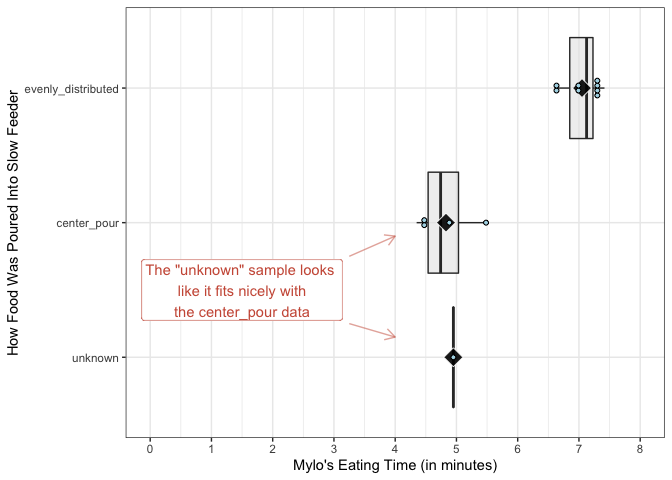<!-- -->

At this point in the experiment, I was tempted to say that my hunch was
correct. Given that my wife had followed all the other protocols of the
experiment very well (Not wetting the food, weighing out exactly 137 g
of food, etc.) what else could have really happened? It’s not like one
day Mylo just happened to shave 2 minutes of his feeding time…

So I thought that was case closed. But for thoroughness sake, I wanted
to run a positive control to verify the initial slow feeder time. Maybe
I should have left this stone unturned… let’s check the data on a new
box plot.

``` r
#Identify the first two colors in set1 of R's colrobrewer palette
#display.brewer.all() #See all brewer palletes
#display.brewer.pal(n = 8, name = "Set1") #Look at Set1 specifically, looks like red is first, then blue
Set1_red = brewer.pal(n = 3, name = "Set1")[1] #First hex code is red
Set1_blue = brewer.pal(n = 3, name = "Set1")[2] #Second hex code is blue 

#The plot
ggplot(data = full_dataset %>% filter(feeder_type == 'slow') , mapping = aes(x = forcats::fct_relevel(food_distribution, "unknown","center_pour", "evenly_distributed"), y = time_to_eat_min, fill = data_designation)) +
  geom_boxplot(alpha = 0.6, notch = FALSE, notchwidth = 0.99) +
  stat_summary(fun = mean, geom = "point", aes(group = data_designation), shape = 23, size = 3, alpha = 0.9, color = "white", fill = "black", position = position_dodge(0.75)) +
  geom_dotplot(binaxis = "y", alpha = 1, stackdir = 'center', position = position_dodge(0.75),  dotsize = 0.4) +
  annotate("rect",  xmin  = 2.5, xmax = 3.5, ymin = 5.25, ymax = 7.75, alpha = 0.2, fill = 'grey3') +
  geom_label(
    label = '1. With the newer data from April, \n it appears Mylo has gotten faster \n at eating out of the slow feeder',
    x = 3,
    y = 2.2,
    #position = position_nudge(x = 0.55, y = 5),
    label.padding = unit(0.2, "lines"),
    label.size = 0.15,
    color = 'gray3',
    fill = "white") +
  geom_text(label = '1.', x = 3.4, y = 5.5, color = 'gray3') +
  geom_label(
    label = '2. There appears \n to be overlap \n b/t evenly_dist \n & center_pour',
    x = 2,
    y = 1.1,
    #position = position_nudge(x = 0.55, y = 5),
    label.padding = unit(0.2, "lines"),
    label.size = 0.15,
    color = Set1_red,
    fill = "white") +
  geom_text(label = '2.', x = 2.45, y = 5.2, color = Set1_red, alpha = 0.1) +
  #annotate("segment", x = 3, xend = 3, y = 4.7, yend = 5, alpha = 0.5, color = 'gray3', arrow = arrow(length = unit(2, "mm"))) +
  annotate("segment", x = 2.2, xend = 2.6, y = 5.45, yend = 5.45, alpha = 0.6, color = Set1_red, arrow = arrow(length = unit(2, "mm"), ends = 'both')) +
  scale_fill_brewer(palette = "Set1") +
  theme_bw() +
  scale_y_continuous(breaks = seq(0,10,1), limits = c(0,8)) +
  labs(y = "Mylo's Eating Time (in minutes)", x = "How Food Was Poured Into Slow Feeder") +
  coord_flip()
```

    ## Bin width defaults to 1/30 of the range of the data. Pick better value with `binwidth`.

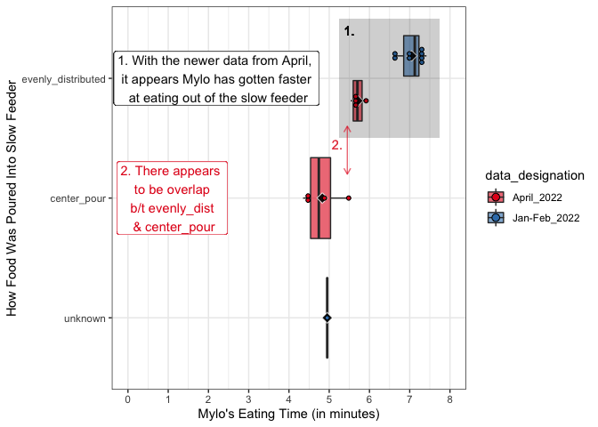<!-- -->

Very interesting. It looks like since I ran the first experiments in
Jan/Feb 2022, Mylo has gotten faster at eating out of the slow feeder.
This both does and doesn’t surprise me. Mylo is pretty smart and tends
to get better at things over time, so some improvemnt was expected. I
don’t think I was expecting quite this big of a shift though, I must
say. It begs the question how much faster has he been getting over time,
and at what feeding time will he bottom out?

Going back to my original motivation for running these new experiments,
trying to verify my hunch that the way the food was poured affected his
eating time. Clearly, this claim won’t be as easy to evaluate now. From
the plot, it looks like there is a larger effect due to the time it’s
been since I ran the initial experiment than in the differences in food
distribution. As a reminder we’re only looking at the slow feeder now.

Let’s see what we can glean from statisical testing.

## Statiscial tests on the new April 2022 data

### Summarize data stratified by data_designation and food_distribution

``` r
slow_feeder_means = full_dataset %>% group_by(feeder_type, data_designation, food_distribution) %>% summarise(avg = mean(time_to_eat_min), std_dev = sd(time_to_eat_min))
```

    ## `summarise()` has grouped output by 'feeder_type', 'data_designation'. You can override using the `.groups` argument.

``` r
slow_feeder_means
```

    ## # A tibble: 5 × 5
    ## # Groups:   feeder_type, data_designation [3]
    ##   feeder_type data_designation food_distribution    avg std_dev
    ##   <chr>       <chr>            <chr>              <dbl>   <dbl>
    ## 1 fast        Jan-Feb_2022     evenly_distributed  2.86   0.451
    ## 2 slow        April_2022       center_pour         4.83   0.488
    ## 3 slow        April_2022       evenly_distributed  5.71   0.171
    ## 4 slow        Jan-Feb_2022     evenly_distributed  7.05   0.301
    ## 5 slow        Jan-Feb_2022     unknown             4.95  NA

Above is just a simple table of means and standard deviations for
reference.

Let’s first assess the statistical significance of Mylo’s eating time
difference for food evenly distributed in the slow feeder

``` r
### Run ANOVA ###

even_dist_new_aov = aov(time_to_eat_min ~ data_designation, data = full_dataset %>% filter(feeder_type == 'slow', food_distribution == 'evenly_distributed'))
summary(even_dist_new_aov)
```

    ##                  Df Sum Sq Mean Sq F value   Pr(>F)    
    ## data_designation  1  4.770   4.770   65.88 1.04e-05 ***
    ## Residuals        10  0.724   0.072                     
    ## ---
    ## Signif. codes:  0 '***' 0.001 '**' 0.01 '*' 0.05 '.' 0.1 ' ' 1

``` r
even_dist_new_aov$coefficients
```

    ##                  (Intercept) data_designationJan-Feb_2022 
    ##                       5.7125                       1.3375

The ANOVA supports the visual. There is a significant difference between
Mylo’s eating time in April as opposed to the Jan/Feb time frame.

To verify the ANOVA results, assumptions were checked as follows.

``` r
### Check assumptions for ANOVA ###

# Assumption 1: Obs. are independent. This is true here

# Assumption 2: Errors are normally distributed - Visual test

  plot(even_dist_new_aov, which = c(1,2))
```

<!-- -->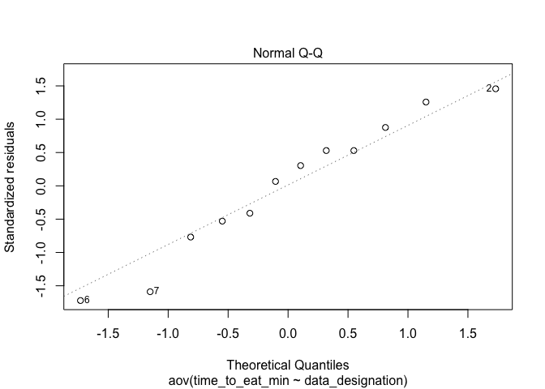<!-- -->

``` r
  #looking at the Q-Q plot of residuals, it appears that the errors are normally distributed. 
  
# Assumption 2: Errors are normally distributed - Formal statistical test 

shapiro.test(residuals(even_dist_new_aov)) #Data is normal 
```

    ## 
    ##  Shapiro-Wilk normality test
    ## 
    ## data:  residuals(even_dist_new_aov)
    ## W = 0.95457, p-value = 0.7045

``` r
# Assumption 3: Equal Variance - Formal statistical test

leveneTest(time_to_eat_min ~ data_designation, data = full_dataset %>% filter(feeder_type == 'slow', food_distribution == 'evenly_distributed'), center = "mean")
```

    ## Warning in leveneTest.default(y = y, group = group, ...): group coerced to
    ## factor.

    ## Levene's Test for Homogeneity of Variance (center = "mean")
    ##       Df F value Pr(>F)
    ## group  1  1.5964 0.2351
    ##       10

``` r
  #Variances are not statistically different among the groups. 

# Assumptions check out!
```

### Since we passed the assumptions we can make the following statements about his eating times for the slow feeder:

``` r
# Using mean estimate 
print(paste('When we fed Mylo in Jan/Feb 2022, he ate, on average,', round(even_dist_new_aov$coefficients[2],2), 'minutes slower then he did in April 2022'))
```

    ## [1] "When we fed Mylo in Jan/Feb 2022, he ate, on average, 1.34 minutes slower then he did in April 2022"

``` r
# Using confidence interval 

print(paste('With 95% confidence, we can say the true mean lies between', round(confint(even_dist_new_aov)[2,1],2), 'and', round(confint(even_dist_new_aov)[2,2],2), 'minutes, in terms of how much longer it took Mylo to eat using the slow feeder in Jan/Feb 2022 as opposed to in April 2022'))
```

    ## [1] "With 95% confidence, we can say the true mean lies between 0.97 and 1.7 minutes, in terms of how much longer it took Mylo to eat using the slow feeder in Jan/Feb 2022 as opposed to in April 2022"

### In the data collected in April 2022, was there a significant difference in the way the food was distributed in the feeder?

``` r
### Run ANOVA ###

dist_new_aov = aov(time_to_eat_min ~ food_distribution, data = full_dataset %>% filter(feeder_type == 'slow', data_designation == "April_2022"))
summary(dist_new_aov)
```

    ##                   Df Sum Sq Mean Sq F value Pr(>F)  
    ## food_distribution  1  1.561  1.5606   11.69 0.0142 *
    ## Residuals          6  0.801  0.1335                 
    ## ---
    ## Signif. codes:  0 '***' 0.001 '**' 0.01 '*' 0.05 '.' 0.1 ' ' 1

``` r
dist_new_aov$coefficients
```

    ##                         (Intercept) food_distributionevenly_distributed 
    ##                           4.8291667                           0.8833333

The ANOVA is saying there is significance here. It’s saying that he does
in fact eat slower when the food is evenly distributed.

Again, let’s check our assumptions:

``` r
### Check assumptions for ANOVA ###

# Assumption 1: Obs. are independent. This is true here

# Assumption 2: Errors are normally distributed - Visual test

  plot(dist_new_aov)
```

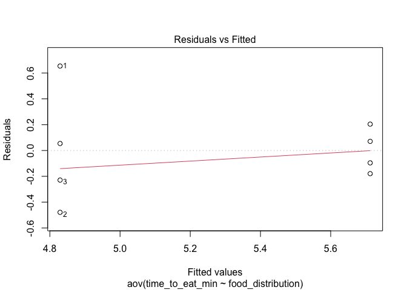<!-- -->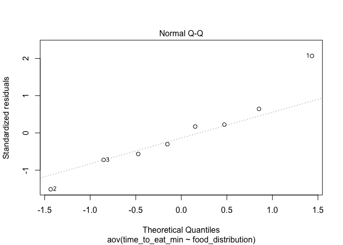<!-- -->

    ## hat values (leverages) are all = 0.25
    ##  and there are no factor predictors; no plot no. 5

<!-- --><!-- -->

``` r
  #looking at the Q-Q plot of residuals, it appears that the errors are normally distributed. Perhaps some skew happening at the ends.
  
# Assumption 2: Errors are normally distributed - Formal statistical test 

shapiro.test(residuals(dist_new_aov)) #Data is normal 
```

    ## 
    ##  Shapiro-Wilk normality test
    ## 
    ## data:  residuals(dist_new_aov)
    ## W = 0.95598, p-value = 0.7711

``` r
# Assumption 3: Equal Variance - Formal statistical test

leveneTest(time_to_eat_min ~ food_distribution, data = full_dataset %>% filter(feeder_type == 'slow', data_designation == "April_2022"), center = "mean")
```

    ## Warning in leveneTest.default(y = y, group = group, ...): group coerced to
    ## factor.

    ## Levene's Test for Homogeneity of Variance (center = "mean")
    ##       Df F value Pr(>F)
    ## group  1  2.5193 0.1636
    ##        6

``` r
  #Variances are not statistically different among the groups. 

# Assumptions check out!
```

### Since we passed the assumptions we can make the following statements about his eating times in relation to how the food is distributed in the feeder:

``` r
# Using mean estimate 
print(paste('When we put food into the feeder and ensure it is evenly distributed, he eats, on average,', round(dist_new_aov$coefficients[2],2), 'min or', round(dist_new_aov$coefficients[2],2)*60, 'seconds slower then he does if you simply dump the food in the center'))
```

    ## [1] "When we put food into the feeder and ensure it is evenly distributed, he eats, on average, 0.88 min or 52.8 seconds slower then he does if you simply dump the food in the center"

``` r
# Using confidence interval 

print(paste('With 95% confidence, we can say the true mean lies between', round(confint(dist_new_aov)[2,1],2)*60, 'and', round(confint(dist_new_aov)[2,2],2)*60, 'seconds, in terms of how much longer it takes Mylo to eat when you evenly distribute his food in the slow feeder'))
```

    ## [1] "With 95% confidence, we can say the true mean lies between 15 and 91.2 seconds, in terms of how much longer it takes Mylo to eat when you evenly distribute his food in the slow feeder"

While there is a significant difference here, is it practically
significant? At the lower end of the interval, that is only about 15
seconds of difference.

Ultimately, when it comes to whether my wife evenly distributed his food
before feeding him and running the test… the best I can say is MAYBE she
didn’t. Because, it does seem that all else held constant, a center pour
can shorten his eating time. But that said, with the confidence interval
we’d expect a 15 to 91 second difference. In the original experiment,
the feed time when she ran the experiment was 4.95 min as opposed to:

``` r
mean_of_original_slow_feed = mean(mylo_data_sans_outliers$time_to_eat_min[mylo_data_sans_outliers$feeder_type == 'slow' ])
mean_of_original_slow_feed
```

    ## [1] 7.05

7.05 min. So that was a whopping 2.10 minute, or 126 second difference.
That is over double the mean difference between the evenly distributed
food and center pour in April 2022.

Ideally, this test should have been run during the initial time frame,
but hindsight is often 20/20 when performing experiments. We may never
know exactly what happened with this data point, though a center pour
MAY have been a contributing factor.

Finally, I want to do a brief investigation into how Mylo’s eating time
in the slow feeder has seemingly decreased over time.

## Increase in eating speed over time

### Visualize the difference in times via a line plot

``` r
mean_of_new_slow_feed = round(mean(full_dataset$time_to_eat_min[full_dataset$feeder_type == 'slow' & full_dataset$food_distribution == 'evenly_distributed' & full_dataset$data_designation == 'April_2022']),2)

mean_of_fast_feed = round(mean(full_dataset$time_to_eat_min[full_dataset$feeder_type == 'fast']),2)

#Plot of eating time across time for the slow feeder, and excluding my wife's initial outlier, and the subsequent outlier studies
ggplot(data = full_dataset %>% filter(food_distribution == 'evenly_distributed'), mapping = aes(x = Day, y = time_to_eat_min, color = feeder_type)) +
  geom_line(aes(group = feeder_type )) +
  scale_fill_brewer(palette = "Set1") +
  geom_point(alpha = 0.8) +
  geom_segment(x = as.POSIXct("2022-01-25"), xend = as.POSIXct("2022-02-10"), y = mean_of_original_slow_feed, yend = mean_of_original_slow_feed, 
               color = 'gray55',  alpha = 0.5) +
  geom_point(x = as.POSIXct("2022-02-02"), y = mean_of_original_slow_feed, size = 25, pch = 1, alpha = 0.5, show.legend = FALSE, color = 'gray55') +
  geom_text(x =as.POSIXct("2022-02-18"), y = mean_of_original_slow_feed, 
            label = paste('Avg = ', mean_of_original_slow_feed, 'min'), color = 'gray55', vjust = -.4) +
  geom_segment(x = as.POSIXct("2022-04-17"), xend = as.POSIXct("2022-04-29"), y = mean_of_new_slow_feed, yend = mean_of_new_slow_feed,  color = 'gray55',  alpha = 0.5) +
  geom_point(x = as.POSIXct("2022-04-23"), y = mean_of_new_slow_feed, size = 20, pch = 1, alpha = 0.5, show.legend = FALSE, color = 'gray55') +
  geom_text(x =as.POSIXct("2022-04-08"), y = mean_of_new_slow_feed, 
            label = paste('Avg =', mean_of_new_slow_feed, 'min'), color = 'gray55', alpha = 0.5, vjust = 1.5) +
  geom_hline(yintercept = mean_of_fast_feed, color = Set1_red) +
  geom_text(x = as.POSIXct("2022-02-20"), y = mean_of_fast_feed, label = paste('Avg = ', mean_of_fast_feed, 'min'), vjust = -0.5, color = Set1_red, alpha = 0.5) + 
  theme(legend.position = "none") +
  theme_bw() +
  scale_y_continuous(breaks = seq(0,10,1), limits = c(0,8)) +
  labs(y = "Mylo's Eating Time (in minutes)", x = "Date (2022)")
```

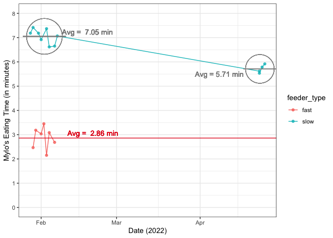<!-- -->

The data and graph speak for themselves here. The two clusters of data
points for the slow feeder are definitely different with regards to
their means. The line between the Jan/Feb and Apr data points gives us
an idea of what his learning speed looks like over time. Even though he
is faster now, its stil takes him considerably longer to to eat of the
slow feeder.

## Calculate Mylo’s hypothetical linear learning rate

If we assume a linear decrease in eating time from the last day of the
February batch of data points to the first day of the April batch, what
would that look like?

``` r
last_date_Feb = max(full_dataset$Day[lubridate::month(full_dataset$Day) == 2])
first_date_Apr = min(full_dataset$Day[lubridate::month(full_dataset$Day) == 4])

linear_eating_rate = (mean_of_original_slow_feed - mean_of_new_slow_feed)/abs(as.numeric(last_date_Feb - first_date_Apr)) # in minutes
linear_eating_rate*60 # in seconds 
```

    ## [1] 1.10137

``` r
print(paste("Mylo's hypothetical linear increase in speed is", round(linear_eating_rate*60,2), "seconds per day or", round(linear_eating_rate*30.5*60,2), "seconds per month"))
```

    ## [1] "Mylo's hypothetical linear increase in speed is 1.1 seconds per day or 33.59 seconds per month"

In reality, I’m guessing his eating time in the slow feeder is actually
following an exponential decay function. But, I’d have to get more data
over time to really estimate the decay parameters. I am curious to see
what eating time he is asymptotically approaching.

But, here the linear estimate provides us an idea of what might have
been going on during the intermediate time frame.

Here is this the same graph as before, but this time with the slope
estimate included.

``` r
ggplot(data = full_dataset %>% filter(food_distribution == 'evenly_distributed'), mapping = aes(x = Day, y = time_to_eat_min, color = feeder_type)) +
  geom_line(aes(group = feeder_type )) +
  scale_fill_brewer(palette = "Set1") +
  geom_point(alpha = 0.8) +
  geom_segment(x = as.POSIXct("2022-01-25"), xend = as.POSIXct("2022-02-10"), y = mean_of_original_slow_feed, yend = mean_of_original_slow_feed, 
               color = 'gray55',  alpha = 0.5) +
  geom_point(x = as.POSIXct("2022-02-02"), y = mean_of_original_slow_feed, size = 25, pch = 1, alpha = 0.5, show.legend = FALSE, color = 'gray55') +
  geom_text(x =as.POSIXct("2022-02-18"), y = mean_of_original_slow_feed, 
            label = paste('Avg = ', mean_of_original_slow_feed, 'min'), color = 'gray55', vjust = -.4) +
  geom_segment(x = as.POSIXct("2022-04-17"), xend = as.POSIXct("2022-04-29"), y = mean_of_new_slow_feed, yend = mean_of_new_slow_feed,  color = 'gray55',  alpha = 0.5) +
  geom_point(x = as.POSIXct("2022-04-23"), y = mean_of_new_slow_feed, size = 20, pch = 1, alpha = 0.5, show.legend = FALSE, color = 'gray55') +
  geom_text(x =as.POSIXct("2022-04-10"), y = mean_of_new_slow_feed, 
            label = paste('Avg =', mean_of_new_slow_feed, 'min'), color = 'gray55', alpha = 0.5, vjust = -2.1) +
  geom_hline(yintercept = mean_of_fast_feed, color = Set1_red) +
  geom_text(x = as.POSIXct("2022-02-20"), y = mean_of_fast_feed, 
            label = paste('Avg = ', mean_of_fast_feed, 'min'), vjust = -0.5, color = Set1_red, alpha = 0.5) + 
  geom_text(x = as.POSIXct("2022-03-15"), y = 6.1,
            label = paste("Rate = ", -round(linear_eating_rate*30.5*60,1), "seconds per month"), color = "turquoise3", angle = -8.5) + 
  theme(legend.position = "none") +
  theme_bw() +
  scale_y_continuous(breaks = seq(0,10,1), limits = c(0,8)) +
  labs(y = "Mylo's Eating Time (in minutes)", x = "Date (2022)")
```

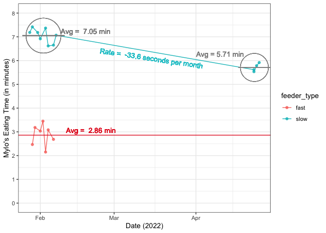<!-- -->

# Wrap Up

If I were to do a part two for this experiment, I would look at the
times for the slow feeder (at both feeding times) once or twice a week
over several months to try and estimate the true rate at which he is
getting faster and to estimate a plateau point.

In hindsight, I would have done this at the time of purchase. Next time
I get a new feeder, I’ll know what I need to do!

Anyways, all this data and eating has pup tired
/Documents/Mylo/Mylo%20Slow%20Feeder%20Project/Photos/tired_buddy.jpeg)
